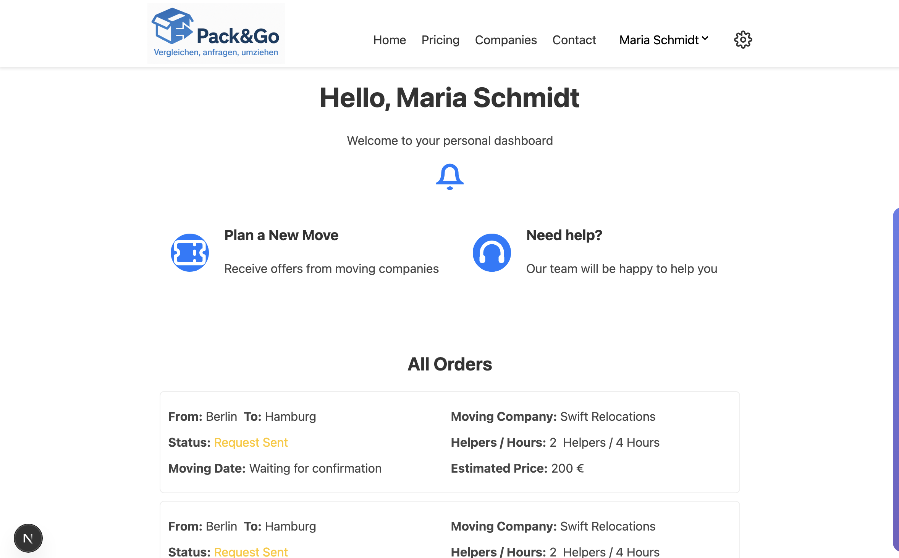

# Pack & Go - Moving Platform

Pack & Go is a modern web platform that connects customers with certified moving companies, featuring transparent pricing, quality certification, and streamlined booking processes.

## 📷 App Preview

  <table>
    <tr>
      <td align="center">
        
        
<em>Homepage</em>

      </td>
      <td align="center">
        
        
<em>Company Reviews</em>

      </td>
    </tr>
    <tr>
      <td align="center">
        
        
<em>CompanyDashboard</em>

      </td>
      <td align="center">
        
        
<em>User Dashboard</em>

      </td>
    </tr>
  </table>

  

## Features

- **Transparent Pricing**: Clear, upfront pricing with no hidden fees
- **Quality Certification**: Verified moving companies with quality ratings
- **Easy Booking**: Streamlined order process from quote to completion
- **Review System**: Customer feedback and rating system
- **Admin Dashboard**: Comprehensive management tools for platform administration
- **Company Dashboard**: Tools for moving companies to manage their services
- **User Accounts**: Personal dashboards for customers to track their moves

## Test Accounts

### User Accounts
- **Maria Schmidt** - maria.schmidt@email.com (default user)
- **Thomas Müller** - thomas.mueller@email.com
- **Anna Weber** - anna.weber@email.com
- **Kevin Bauer** - kevin.bauer@email.com
- **Sarah Johnson** - sarah.johnson@email.com
- **Michael Wagner** - michael.wagner@email.com
- **Lisa Chen** - lisa.chen@email.com
- **Robert Klein** - robert.klein@email.com

### Company Accounts

#### Swift Relocations (Default Company)
- **Email**: swift.relocations@email.com
- **Service Areas**: Berlin to Cologne, Dusseldorf, Essen, Dortmund
- **Note**: All test reviews are available for this company

#### MoveMax Berlin
- **Email**: movemax.berlin@email.com
- **Service Areas**: Berlin to Munich, Frankfurt, Stuttgart

#### Capital Movers
- **Email**: capital.movers@email.com
- **Service Areas**: Berlin to Hamburg, Bremen

#### Berlin Express Moving
- **Email**: berlin.express@email.com
- **Service Areas**: Berlin to Dresden, Leipzig, Chemnitz, Rostock, Magdeburg

#### Prime Movers Germany
- **Email**: prime.movers@email.com
- **Service Areas**: Berlin to Nuremberg, Augsburg, Regensburg

#### Metro Moving Solutions
- **Email**: metro.moving@email.com
- **Service Areas**: Berlin to Hannover

## Service Coverage

### Start City
- **Berlin** (primary departure location)

### Destination Cities
- Munich
- Frankfurt
- Stuttgart
- Hamburg
- Bremen
- Cologne
- Dusseldorf
- Essen
- Dortmund
- Dresden
- Leipzig
- Chemnitz
- Rostock
- Magdeburg
- Nuremberg
- Augsburg
- Regensburg
- Hannover

## Team

This project was developed by:

### Jian Lu
- **LinkedIn**: https://www.linkedin.com/in/jian-lu-705184330/
- **GitHub**: https://github.com/LuJian2024

### Angelique
- **LinkedIn**: https://www.linkedin.com/in/angelique-guisse-049541317/
- **GitHub**: https://github.com/Angelique-guisse

### Dursel Türkan
- **LinkedIn**: https://www.linkedin.com/in/dursel-tuerkan/
- **GitHub**: https://github.com/durseltuerkan

### Jing Li
- **LinkedIn**: https://www.linkedin.com/in/jili0/
- **GitHub**: https://github.com/jili0
